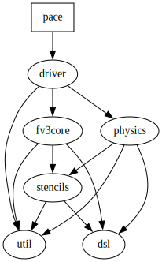

# Pace

Pace is an implementation of the FV3GFS / SHiELD atmospheric model developed by NOAA/GFDL using the GT4Py domain-specific language in Python. The model can be run on a laptop using Python-based backend or on thousands of heterogeneous compute nodes of a large supercomputer.

The top level directory contains the FV3 dynamical core (fv3core), the GFS physics package (fv3gfs-physics), and infrastructure utilities (pace-util).

**WARNING** This repo is under active development - supported features and procedures can change rapidly and without notice.

This git repository is laid out as a mono-repo, containing multiple independent projects. Because of this, it is important not to introduce unintended dependencies between projects. The graph below indicates a project depends on another by an arrow pointing from the parent project to its dependency. For example, the tests for fv3core should be able to run with only files contained under the fv3core and util projects, and should not access any files in the driver or physics packages. Only the top-level tests in Pace are allowed to read all files.



## Building the docker container

While it is possible to install and build pace bare-metal, we can ensure all system libraries are installed with the correct versions by using a Docker container to test and develop pace.

First, you will need to update the git submodules so that any dependencies are cloned and at the correct version:
```shell
git submodule update --init --recursive
```

Then build the `pace` docker image at the top level.
```shell
make build
```
(Note: if you have not authenticated with a GCP account, you can alternatively fetch test data from an FTP server using `make USE_FTP=yes get_test_data` to get started.)

## Downloading test data

The unit and regression tests of pace require data generated from the Fortran reference implementation which has to be downloaded from a Google Cloud Platform storage bucket. Since the bucket is setup as "requester pays", you need a valid GCP account to download the test data. If you do not have a GCP account, there is an option to download basic test data from a public FTP server and you can skip the next step.

First, make sure you have configured the authentication with user credientials and configured Docker with the following commands:
```shell
gcloud auth login
gcloud auth configure-docker
```

Next, you can download the test data for the dynamical core and the physics tests. If you prefer to download test data from the FTP server, use `make USE_FTP=yes get_test_data` instead and this will avoid fetching from a GCP storage bucket.

```shell
cd fv3core
make get_test_data
cd ../fv3gfs-physics
make get_test_data
cd ..
```

## Running the tests (manually)

There are two ways to run the tests, manually by explicitly invoking `pytest` or autmatically using make targets. The former can be used both inside the Docker container as well as for a bare-metal installation and will be described here.

First enter the container and navigate to the pace directory:

```shell
make dev
cd /pace
```

Note that by entering the container with the `make dev` command, volumes for code and test data will be mounted into the container and modifications inside the container will be retained.

There are two sets of tests. The "sequential tests" test components which do not require MPI-parallelism. The "parallel tests" can only within an MPI environment.

To run the sequential and parallel tests for the dynmical core (fv3core), you can execute the following commands (these take a bit of time):

```shell
pytest -v -s --data_path=/pace/fv3core/test_data/8.1.1/c12_6ranks_standard/dycore/ ./fv3core/tests
mpirun -np 6 python -m mpi4py -m pytest -v -s -m parallel --data_path=/pace/fv3core/test_data/8.1.1/c12_6ranks_standard/dycore ./fv3core/tests
```

Note that you must have already downloaded the test data according to the instructions above. The precise path needed for `--data_path` may be different, particularly the version directory.

Similarly, you can run the sequential and parallel tests for the physical parameterizations (fv3gfs-physics). Currently, only the microphysics is integrated into pace and will be tested.

```shell
pytest -v -s --data_path=/pace/test_data/8.1.1/c12_6ranks_baroclinic_dycore_microphysics/physics/ ./fv3gfs-physics/tests --threshold_overrides_file=/pace/fv3gfs-physics/tests/savepoint/translate/overrides/baroclinic.yaml
mpirun -np 6 python -m mpi4py -m pytest -v -s -m parallel --data_path=/pace/test_data/8.1.1/c12_6ranks_baroclinic_dycore_microphysics/physics/ ./fv3gfs-physics/tests --threshold_overrides_file=/pace/fv3gfs-physics/tests/savepoint/translate/overrides/baroclinic.yaml
```

Finally, to test the pace infrastructure utilities (pace-util), you can run the following commands:

```shell
cd pace-util
make test
make test_mpi
```

## Running the tests automatically using Docker

To automatize testing, a set of convenience commands is available that build the Docker image, run the container and execute the tests (dynamical core and physics only). This is mainly useful for CI/CD workflows.

```shell
DEV=y make savepoint_tests
DEV=y make savepoint_tests_mpi
DEV=y make physics_savepoint_tests
DEV=y make physics_savepoint_tests_mpi
```
